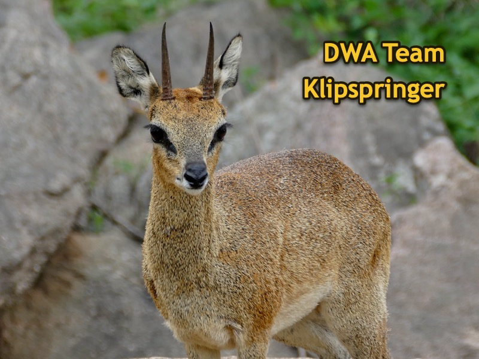

# Ons team

Wij zijn team Klipspringer.

- Jelle Schaafsma
- Roos Lodewijk
- Joris van Lier
- Niels van Ee
- Yannick van den Berg

# Het project

In dit project maken wij een mobiele web applicatie voor het delen van boeken op social media.

# Inhoudsopgave

- [Notulen](./groepsdocumenten/Notulen/)
- [Projectplan](./groepsdocumenten/Projectplan/)
  - [Dagplanning](./groepsdocumenten/Projectplan/Dagplanning.md)
  - [Definition of Done](./groepsdocumenten/Projectplan/Definition%20of%20Done.md)
  - [Opdracht](./groepsdocumenten/Projectplan/Opdracht.md)
  - [Periodeplanning](./groepsdocumenten/Projectplan/Periodeplanning.md)
  - [Procesbeschrijving](./groepsdocumenten/Projectplan/Procesbeschrijving.md)
  - [Product Backlog](./groepsdocumenten/Projectplan/Product%20Backlog.md)
- [SoftwareGuidebook](./groepsdocumenten/Software%20Guidebook/README.md)
- [Client](./client/)
- [Server](./server/)
