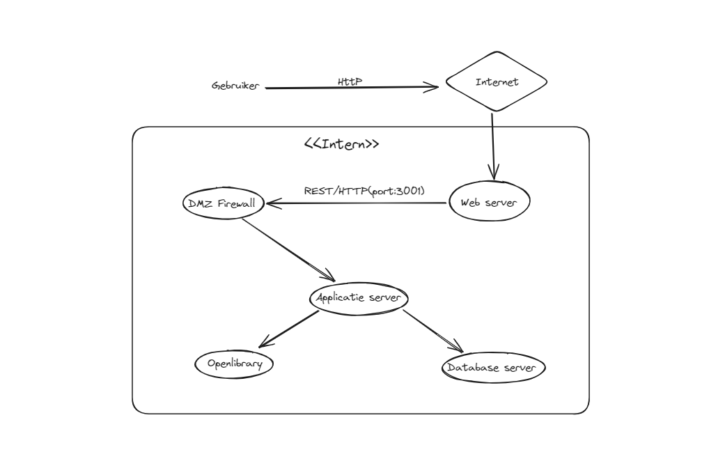

### Infrastructure Architecture
Het doel van een Infrastructure architecture is om een duidelijk beeld te vormen over hoe de applicatie is opgebouwd.
Hierdoor wordt het makkelijker om de applicatie te onderhouden en uit te breiden.

Aangezien wij geen eigen server bezitten, kunnen we daar geen specificaties van beschrijven.
Als de applicatie moet worden gedeployed raden we aan om dan cloudservices te gebruiken.
Omdat de applicatie niet door ons wordt gedeployed, wordt de hardware specificaties uitbesteed aan de cloudservices provider.

In geval van rampen of storingen kan er worden geraadpleegd bij de cloudservice provider.
Het onderhouden en beheren of bewaken van de applicatie zal niet door ons worden verstrekt.

